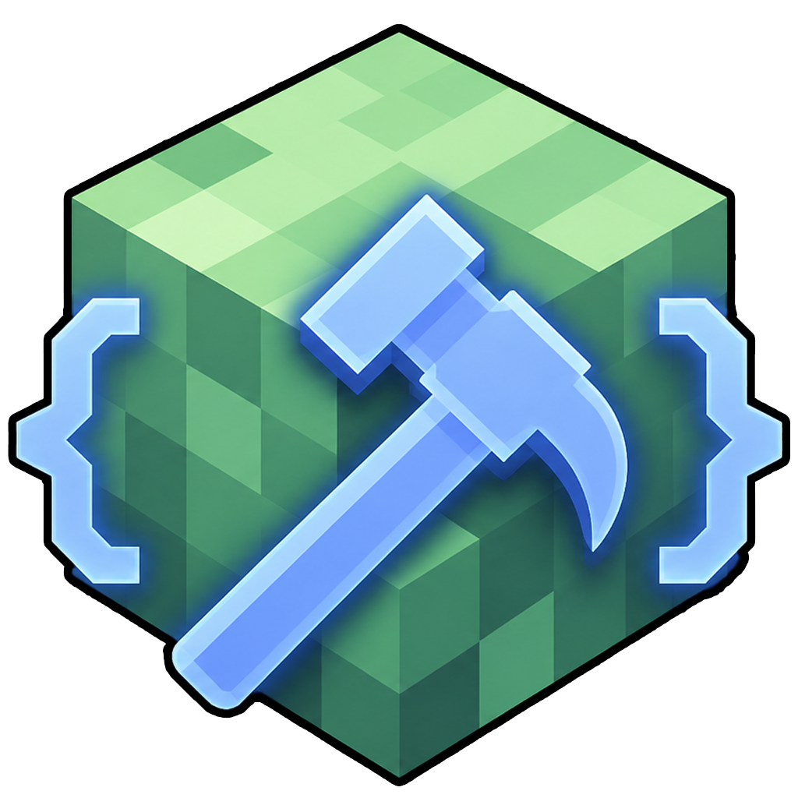
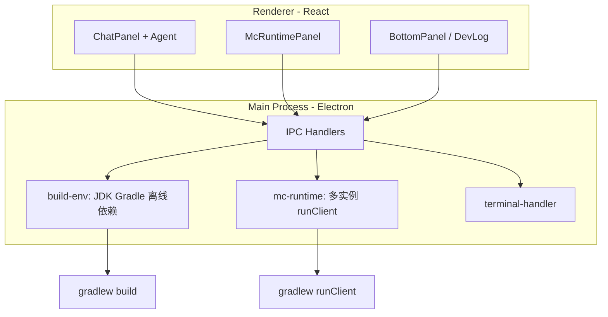

<div align="center">



# ModCrafting

**面向 Fabric 模组开发的 AI 原生桌面环境 —— 用 Vibecoding 把想法变成可运行的 Minecraft 模组。**

[简体中文](#modcrafting) · [English](#english) · [从源码构建](#从源码构建) · [架构](#架构概览) · [Issue](https://github.com/newstarbar/ModCrafting/issues) · [Discussions](https://github.com/newstarbar/ModCrafting/discussions)

[](https://www.gnu.org/licenses/gpl-3.0.html)
[](https://www.electronjs.org/)
[](https://fabricmc.net/)
[](https://github.com/newstarbar/ModCrafting)

</div>

> [!IMPORTANT]
> **ModCrafting 与 Mojang / Microsoft 无任何官方关联。** 使用本软件即表示你同意遵守 [Minecraft 最终用户许可协议](https://www.minecraft.net/zh-hans/eula)。本软件不包含 Minecraft 游戏本体。

> [!TIP]
> **不懂 Gradle？没关系。** 右侧「游戏」面板用图形化进度展示启动状态；AI 负责写代码、改文件、触发构建。终端与命令行默认折叠在「高级」页，仅供开发者备用。

> [!NOTE]
> **自带离线工具链。** 安装包内置 JDK 21、Gradle 与 Fabric 依赖缓存种子，首次启动自动初始化；在无网络或弱网环境下仍可完成模组编译与 `runClient` 测试（依赖预取完成后）。

---

## ModCrafting 是什么

ModCrafting 把 **AI 对话式开发（Vibecoding）**、**Fabric 工程脚手架**、**一键游戏内测试** 和 **离线构建环境** 整合进同一个 Electron 桌面应用。

你描述想要的功能 → AI 规划并修改项目文件 → 在「游戏」面板启动客户端验证 → 崩溃报告一键送回 AI 修复。  
不必在 IDE、终端、Gradle 日志和游戏窗口之间来回切换。

---

## 核心能力

| 能力 | 说明 |
|------|------|
| **Vibecoding 对话开发** | 基于 Plan → Execute 的 Agent 循环；简单问答自动走 Chat 模式，复杂模组任务走完整工具链 |
| **Fabric 项目向导** | 图形化新建项目：Mod ID、包名、作者、版本；自动生成 `build.gradle`、`fabric.mod.json`、入口类 |
| **内置 AI 工具** | `read_file` · `write_file` · `list_directory` · `run_command` · `trigger_build` · `read_error_log` · `complete_step` |
| **图形化游戏测试** | 多实例、阶段进度条、人话摘要；独立 `gameDir` 与 Gradle 隔离，支持联机 mod 多开 |
| **崩溃 → AI 修复** | 自动检测崩溃报告，一键附加到对话上下文 |
| **离线优先工具链** | 捆绑 JDK / Gradle / 依赖种子；启动遮罩 + 进度条，环境未就绪前锁定构建 |
| **高级开发者区** | 编译检查、可折叠构建日志、可展开 xterm、调试日志面板 |
| **API 密钥本地加密** | 支持 DeepSeek 等 OpenAI 兼容端点；密钥仅存本机，不进仓库 |

---

## 快速开始（用户）

### 环境要求

| 项目 | 要求 |
|------|------|
| 操作系统 | **Windows 10/11 x64**（当前主要支持平台） |
| 磁盘空间 | 建议 ≥ **5 GB**（含工具链与依赖缓存） |
| 网络 | 首次打包/预取依赖时需要；日常使用可离线构建 |
| AI | 自备 [DeepSeek](https://platform.deepseek.com/api_keys) 或其他兼容 API Key |

### 安装

从 [GitHub Releases](https://github.com/newstarbar/ModCrafting/releases) 或 [Gitee 发布页](https://gitee.com/chenmo-starry-sky/mod-crafting/releases) 下载（**国内用户推荐 Gitee**）：

| 安装包 | 大小 | 网络 | 适用场景 |
|--------|------|------|----------|
| **完整版** `ModCrafting Setup 1.0.0.exe` | ~1–1.5 GB | 首次复制离线包，之后可离线 | **推荐**。日常开发、网络不稳定 |
| **便携版** `ModCrafting 1.0.0 Portable.exe` | ~80–150 MB | **首次必须联网**下载工具链（约 1GB） | U 盘、临时机器、可接受首启下载 |

> 文件名中的版本号与 Release 标签一致（例如标签 `v1.0.0` 对应 `1.0.0`）。

- **完整版（Setup）**：内置 JDK、Gradle、Fabric 离线依赖；首次启动复制到 `runtime/`，完成后可离线构建。
- **便携版（Portable）**：仅含应用本体与小文件；首次启动自动联网下载 JDK / Gradle / Fabric 依赖。

### 应用内更新

- **Setup 完整版**：**帮助 → 检查更新**。优先从 Gitee 检测与下载，失败自动切换 GitHub；仍失败时可手动打开发布页。
- **Portable 便携版**：不支持应用内自动升级，请到 Gitee / GitHub 发布页下载新版 Portable。

### 三分钟上手

```
1. 启动 ModCrafting → 等待「构建环境已就绪」
2. 左侧「设置」填入 API Key（默认 DeepSeek 端点）
3. 新建 Fabric 项目，或打开已有项目
4. 在中间对话区描述你的模组想法
5. 右侧「游戏」→ 启动游戏，在 Minecraft 中验证效果
```

### 快捷键

| 快捷键 | 动作 |
|--------|------|
| `Ctrl+N` | 新建项目 |
| `Ctrl+O` | 打开项目 |
| `Ctrl+B` | 编译检查（跳转「高级」页） |
| `Ctrl+R` | 启动游戏客户端 |
| `Ctrl+Shift+R` | 停止所有运行中的游戏实例 |

---

## 界面一览

```
┌──────────────┬────────────────────────────┬─────────────────┐
│  会话 / 设置  │      AI 对话（Vibecoding）   │   🎮 游戏        │
│  文件树      │      计划 · 执行 · 流式输出   │   ⚙️ 高级        │
│  最近项目    │                            │  （构建/终端）    │
└──────────────┴────────────────────────────┴─────────────────┘
│                        状态栏：模型 · Token · 工具链              │
└─────────────────────────────────────────────────────────────────┘
```

> 截图与演示 GIF 将在后续 Release 中补充。欢迎通过 [Show and tell](https://github.com/newstarbar/ModCrafting/discussions) 分享你的使用场景。

---

## 架构概览



**默认技术栈（新建项目）**

| 组件 | 版本 |
|------|------|
| Minecraft | 1.21.4 |
| Fabric Loader | 0.16.10 |
| Fabric API | 0.116.0+1.21.4 |
| Fabric Loom | 1.17.12 |
| Gradle | 9.5.0 |
| Java | 21 |

版本锁定见 [`resources/fabric-versions.json`](resources/fabric-versions.json)。

---

## 从源码构建

适合贡献者与高级用户。需要 **Node.js 20+**、**Git**、**Windows x64**。

### 1. 克隆与安装依赖

```bash
git clone https://github.com/newstarbar/ModCrafting.git
cd ModCrafting
npm install
```

### 2. 准备捆绑工具链

```bash
# 下载并解压 JDK 21 + Gradle 9.5 到 resources/
npm run setup:toolchain

# 验证工具链文件是否齐全
npm run verify:toolchain
```

### 3. 预取 Fabric 依赖（需联网，约 1 GB）

```bash
npm run prefetch:deps
```

会在 `resources/gradle-home-seed/` 生成离线依赖种子，打包时一并分发。

### 4. 开发与打包

```bash
# 开发模式（热更新）
npm run dev

# 仅编译 TypeScript / 前端
npm run build

# Windows 安装包 + 便携版（一键构建两者）
npm run build:win

# 或分别构建
npm run build:win:setup
npm run build:win:portable
```

产物输出到 `release/`。

### 常用脚本

| 命令 | 说明 |
|------|------|
| `npm run dev` | Electron 开发模式 |
| `npm run setup:toolchain` | 下载 JDK 21 + Gradle 发行版 |
| `npm run prefetch:deps` | 预取 Fabric/Minecraft 依赖到种子目录 |
| `npm run verify:toolchain` | 检查 JDK / Gradle / Wrapper |
| `npm run verify:offline` | 验证离线构建流程 |
| `npm run build:win` | 构建 Setup + Portable（推荐发版用） |
| `npm run build:win:setup` | 仅构建 NSIS 完整版（含离线工具链） |
| `npm run build:win:portable` | 仅构建轻量便携版（不含 JDK/Gradle/seed） |
| `npm run generate:icon` | 从 appIcon.png / installerIcon.png 生成 .ico |
| `npm run render:manifest` | 渲染 `build/update-manifest.json`（发布用） |

### 发布新版本

1. 更新 `package.json` 的 `version`
2. 打 tag 并推送：`git tag v1.0.0 && git push origin v1.0.0`
3. GitHub Actions 自动构建 Setup + Portable、发布 GitHub Release、同步 Gitee（需配置仓库 Secret `GITEE_TOKEN`）
4. 详见 [`RELEASE.md`](RELEASE.md)（Release 正文由 CI 根据 commit 自动生成，无需手改）

---

## AI 配置

在应用左侧「设置」中配置：

| 字段 | 默认值 | 说明 |
|------|--------|------|
| API Endpoint | `https://api.deepseek.com/v1` | OpenAI 兼容接口地址 |
| Model | `deepseek-v4-flash` | 可按提供商文档更换 |
| API Key | （用户填写） | 本地加密存储，**切勿提交到 Git** |

Agent 会根据用户输入自动分流：

- **Chat 模式**：概念问答、简单说明，跳过 Plan → Execute
- **开发模式**：创建/修改模组、多文件重构，启用完整工具调用与步骤计划

---

## 与其他方案对比

| | ModCrafting | 手动 IDEA + Gradle | 通用 AI 终端 Agent |
|--|-------------|-------------------|-------------------|
| 面向场景 | **Minecraft Fabric 模组** | 通用 Java | 通用代码 |
| 新建 Fabric 项目 | **向导一键** | 手动模板 / 文档 | 需自己搭脚手架 |
| 游戏内测试 | **图形化多实例面板** | 自己跑 `gradlew runClient` | 通常不支持 |
| 离线构建环境 | **内置捆绑** | 自行配置 JDK/Gradle | 依赖本机环境 |
| 崩溃报告 → AI | **一键附加** | 手动复制日志 | 手动 |
| 非开发者友好 | **默认图形化** | 低 | 中（终端为主） |
| 许可证 | **GPL-3.0** | — | 各异 |

---

## 项目结构

```
ModCrafting/
├── src/
│   ├── main/           # Electron 主进程：IPC、工具链、游戏实例、终端
│   ├── preload/        # 安全桥接 API
│   └── renderer/       # React UI：对话、游戏面板、项目向导
├── scripts/            # 工具链下载、依赖预取、打包辅助
├── resources/          # JDK / Gradle / 依赖种子（大部分由脚本生成，不进 Git）
├── build/              # 安装包资源：图标、NSIS 脚本、许可说明
└── package.json
```

---

## 故障排除

<details>
<summary><strong>启动时工具链初始化失败</strong></summary>

1. 确认 `resources/jdk-21` 与 `resources/gradle-9.5` 存在且完整  
2. 运行 `npm run verify:toolchain` 查看缺失项  
3. 便携版首次启动会复制 `runtime/`，磁盘需预留 ≥ 2 GB  
4. 点击遮罩上的「重试」重新初始化  

</details>

<details>
<summary><strong>游戏启动失败 / 编译错误</strong></summary>

1. 在「游戏」卡片展开「查看技术详情」  
2. 若有崩溃报告，点击「发送给 AI 修复」  
3. 在「高级」页执行「构建」单独验证编译  
4. 确认 API Key 有效且余额充足（AI 修复需要）  

</details>

<details>
<summary><strong>多实例联机测试时第一个实例被关闭</strong></summary>

请升级到最新版本。当前实现为每个实例分配独立 `gameDir` 与 Gradle 守护进程目录，避免第二个 `runClient` 停止第一个实例的 Daemon。

</details>

<details>
<summary><strong>SmartScreen 提示「未知发布者」</strong></summary>

开源构建暂未代码签名。点击「更多信息」→「仍要运行」。安装包与便携版均来自 GitHub Releases。

</details>

---

## 非目标

> [!IMPORTANT]
> ModCrafting 有意保持专注。以下能力**不在**当前设计范围内：

- **Forge / NeoForge 支持** — 当前仅 Fabric + Loom
- **macOS / Linux 安装包** — 欢迎社区贡献，官方优先 Windows
- **内置 Minecraft 或 Mojang 账号** — 需用户自行拥有合法游戏副本
- **多人联机服务器托管** — 仅提供本地多客户端实例测试
- **替代专业 IDE 的全部功能** — 高级 Java 重构仍以 IDEA 为参照系

---

## 参与贡献

欢迎 Issue、PR 与 Discussions。

1. Fork 本仓库  
2. 创建特性分支：`git checkout -b feature/my-feature`  
3. 从源码构建并验证：`npm run dev`  
4. 提交 PR 并描述变更动机与测试方式  

提交前请确认：

- 未包含 API Key、`.env`、个人路径  
- 未提交 `node_modules/`、`release/`、`runtime/`、`resources/jdk-21/` 等大文件  
- 遵循现有代码风格，改动范围尽量聚焦  

---

## 社区与支持

- **Bug 反馈** → [Issues](https://github.com/newstarbar/ModCrafting/issues)  
- **功能建议 / 使用展示** → [Discussions](https://github.com/newstarbar/ModCrafting/discussions)  
- **安全问题** → 请通过 GitHub Security Advisory 私下报告，勿在公开 Issue 中贴密钥或漏洞细节  

---

## 第三方组件

安装包捆绑或依赖以下上游项目（非完整列表）：

- [Electron](https://www.electronjs.org/) · [React](https://react.dev/) · [Vite](https://vitejs.dev/)
- [Eclipse Temurin JDK 21](https://adoptium.net/) · [Gradle](https://gradle.org/)
- [Fabric Loader / Loom / API](https://fabricmc.net/)
- [xterm.js](https://xtermjs.org/) · [node-pty](https://github.com/microsoft/node-pty)

详细许可说明见 [`THIRD_PARTY.md`](THIRD_PARTY.md) 与安装目录许可文件。

---

## 许可证

本项目源码以 **[GPL-3.0](https://www.gnu.org/licenses/gpl-3.0.html)** 发布（见 [`package.json`](package.json)）。上传 GitHub 前请在根目录添加 `LICENSE` 全文文件。

安装包内的 [`build/license.txt`](build/license.txt) 为面向最终用户的分发说明，与源码许可证相互独立。

---

<div align="center">

**如果觉得 ModCrafting 有帮助，欢迎 Star ⭐**

Built by [@newstarbar](https://github.com/newstarbar) and contributors

</div>

---

<a id="english"></a>

## English

**ModCrafting** is an AI-native desktop environment for **Minecraft Fabric mod development**. Describe your mod in natural language, let the agent edit project files, then launch the game from a graphical panel to verify — no Gradle expertise required.

### Highlights

- Vibecoding agent with plan/execute loop and tool calling  
- Fabric project wizard (MC 1.21.4, Loom, Java 21)  
- Bundled offline toolchain (JDK, Gradle, dependency seed)  
- Graphical game test panel with multi-instance support  
- Crash reports → one-click send to AI for repair  

### Quick start (developers)

```bash
git clone https://github.com/newstarbar/ModCrafting.git
cd ModCrafting
npm install
npm run setup:toolchain
npm run prefetch:deps
npm run dev
```

### Disclaimer

Not affiliated with Mojang or Microsoft. You must own a legitimate copy of Minecraft and comply with the [Minecraft EULA](https://www.minecraft.net/en-us/eula).

Licensed under **GPL-3.0** — see [`package.json`](package.json).
