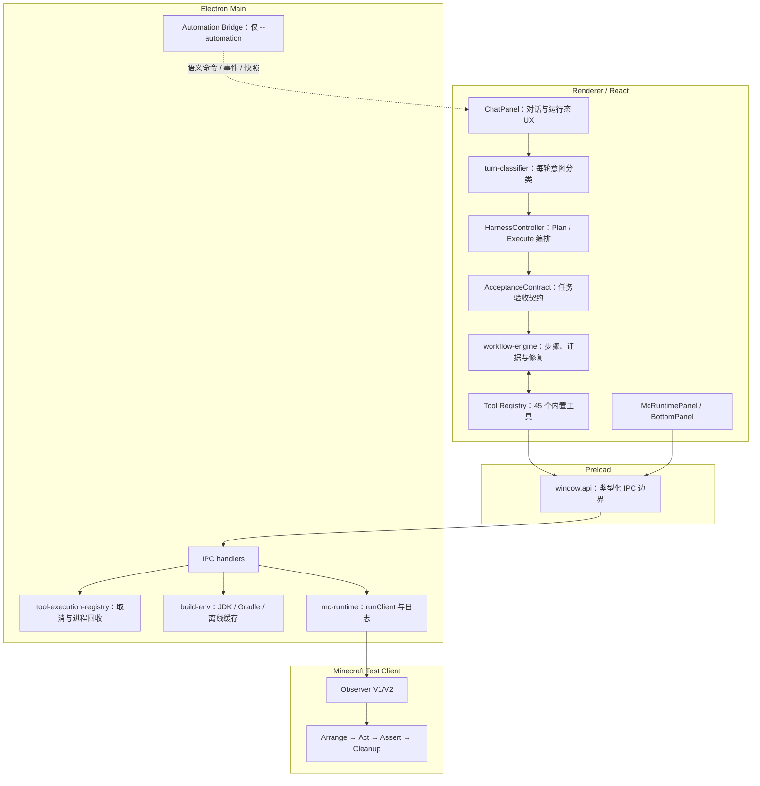

# 架构概览

ModCrafting 是面向 Minecraft Fabric 模组开发的 AI 原生 Electron 桌面应用。正式应用采用主进程、预加载和 Renderer 三层；开发测试时额外启用 Test Lab Automation Bridge，游戏内验证由随测试项目启动的 Observer 模组提供。

## 运行时架构

## 主进程（`src/main/`）

入口为 `src/main/index.ts`。正式模式负责窗口、IPC、工具链、Minecraft Runtime、终端和更新；自动化模式在申请单实例锁前切换独立 `userData`，禁用更新器并启动只绑定 `127.0.0.1` 的认证桥。

| 模块 | 当前职责 |
|---|---|
| `ipc-handlers.ts` | 文件、项目、配置、知识库、构建和 Minecraft IPC |
| `tool-execution-registry.ts` | 跟踪可取消工具，停止任务时回收 Gradle、Java 和命令进程树 |
| `build-env.ts` | JDK 21、Gradle 9.5、Wrapper 和离线依赖环境 |
| `mc-runtime.ts` | 多实例 `runClient`、独立 gameDir/Gradle Home、日志与崩溃检测 |
| `automation-server.ts` | Test Lab 回环 HTTP 桥；随机端口、256 位 Token、事件账本、快照和截图 |
| `api-config.ts` | Provider 配置及 `safeStorage` 密钥存储；Test Lab 只读载入已选 Provider 到内存 |
| `minecraft-data-service.ts` | Minecraft 标准 ID、属性和配方结构化查询 |
| `mc-wiki-vector-service.ts` | 中文 Minecraft 百科向量检索 |
| `terminal-handler.ts` | 基于 node-pty 的终端会话与事件转发 |
| `updater.ts` | 正式安装包更新检查；自动化模式不启动更新流程 |

Automation Bridge 只提供 capabilities、command、events、snapshot 和 shutdown，不提供任意 JavaScript 执行，不开放 CORS，所有接口都要求本次运行的 Bearer Token。

## 预加载（`src/preload/`）

`contextBridge.exposeInMainWorld('api', ...)` 是 Renderer 访问主进程能力的唯一正式边界。API 包括文件、项目、构建、Minecraft、知识库、配置以及自动化命令收发；事件订阅必须返回清理函数。

## Renderer（`src/renderer/src/`）

`App.tsx` 管理工作区、会话和自动化语义命令；`ChatPanel.tsx` 管理真实对话生命周期、计划卡片、工具事件、澄清和运行中的 Assistant 活跃状态。

Harness 的核心职责分层如下：

| 模块 | 当前职责 |
|---|---|
| `controller.ts` | 会话生命周期、Provider 分类、Plan/Execute 切换、恢复和系统提示词 |
| `turn-classifier.ts` | 原生工具调用、JSON 重试、结构兜底及脱敏诊断 |
| `acceptance-contract.ts` | 将原子需求映射为 build、game assertion 或 user confirmation Oracle |
| `plan-compiler.ts` / `plan-tracker.ts` | 计划解析、去重、迁移、终端顺序和状态持久化 |
| `plan-execution-gate.ts` | 阻止缺少 V2 `gameTest`/AcceptanceContract 的游戏计划执行 |
| `workflow-engine.ts` | 逐步骤执行、证据裁决、修复范围、重复失败守卫和 20/40/3 预算 |
| `step-evidence.ts` | 按步骤类型验证真实结构化证据，拒绝表面成功 |
| `tool-policy.ts` | 45 个内置工具的能力、执行类别、超时和推荐集合的唯一目录 |
| `tool-rejection-guard.ts` | 保留被拒绝工具的真实名称和错误类型，收敛重复非法调用 |
| `game-test-protocol.ts` / `game-test-runner.ts` | V2 规格、动作、断言、会话、新鲜证据与三态裁决 |

详见 [Harness 系统](./harness.md) 和 [Vibecoding 工作流](./workflow.md)。

## Minecraft Observer

Observer 源码位于 `bridge-mod/`，构建产物复制到 `resources/_base_mods/modcrafting-observer.jar`。V1 保持兼容；V2 提供：

- `/v2/capabilities`：协议及可用观测能力；
- `/v2/command`：集成服务端线程执行命令并返回真实结果；
- `/v2/snapshot`：客户端/服务端玩家、背包、Screen、方块、实体、HUD 与渲染轨迹；
- `/v2/query`：注册表、配方、方块和实体单项查询。

Observer 只采集通用 Minecraft 状态，不识别目标模组、业务类名或 Test Lab 场景。缺少能力必须产生 `INCONCLUSIVE`，不能回退为截图成功。

## Test Lab 开发架构

Test Lab 不随正式安装包发布。它通过 `scripts/mcp/modcrafting-test-mcp.ts` 或 `scripts/test/run-app-automation.ts` 启动隔离 Electron：

1. 使用独立 profile 和沙箱项目；
2. 通过语义命令走真实 React/Controller/IPC 生命周期；
3. 使用本地回放 Provider做确定性日常回归；
4. 显式选择真实 Provider 或 Minecraft 进行低频烟测；
5. 保存事件账本、快照、截图、脱敏 Provider 请求和裁决报告。

具体工具、路径和限制见 [Test Lab MCP](./test-lab-mcp.md)。

## 默认技术栈

| 组件 | 版本 |
|---|---|
| Electron / React | 42 / 19 |
| Minecraft | 1.21.4 |
| Fabric Loader / API | 0.16.10 / 0.116.0+1.21.4 |
| Fabric Loom | 1.17.12 |
| Gradle / Java | 9.5.0 / 21 |

版本锁定见 `resources/fabric-versions.json`。

## 维护边界

- 工具链下载逻辑在 `scripts/toolchain/toolchain-download.mjs` 与 `src/main/toolchain-download.ts` 各有一份，必须同步。
- 新内置工具必须加入 `tool-policy.ts`；启动和测试会拒绝没有策略的工具。
- 生产 Harness 不得导入 `scripts/test/scenarios/`，不得包含具体黑盒样例的实现策略或额外预算。
- 修改 Observer 后运行 `npm run bridge:build` 并提交更新后的基础模组 JAR。
- 升级 Minecraft 版本后运行 `npm run knowledge:download` 更新对应知识资源。
