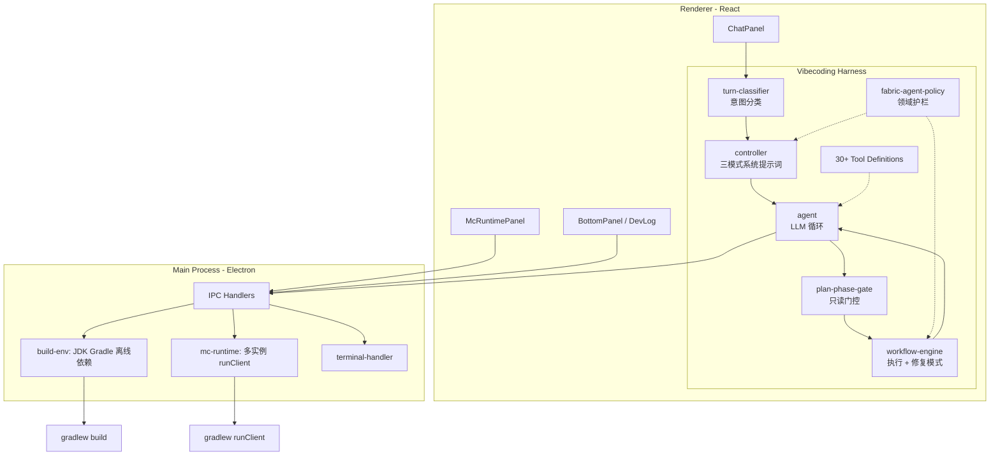

# 架构概览

ModCrafting 是一个用于 AI 辅助 Minecraft Fabric 模组开发的 Electron 桌面应用，采用三进程架构。

## 进程架构



## 主进程（`src/main/`）

入口：`src/main/index.ts` — 创建 BrowserWindow（contextIsolation 开启，nodeIntegration 关闭，sandbox 关闭），注册所有 IPC 处理器、菜单和更新器。

| 模块 | 用途 |
|--------|---------|
| `ipc-handlers.ts` | 中央 IPC 处理器注册（约 50 个通道：fs, dialog, project, env, config, secrets, knowledge, mc, updater） |
| `build-env.ts` | 工具链子系统：JDK 21 + Gradle 9.5 配置，Fabric 离线依赖缓存（gradle-home-seed），gradlew.bat 生成，三种版本（dev/full/portable） |
| `mc-runtime.ts` | Minecraft 游戏实例管理器：启动 `gradlew runClient`，每个实例独立的 GRADLE_USER_HOME，崩溃检测，日志流式输出 |
| `terminal-handler.ts` | PTY 终端管理（基于 node-pty），通过 `terminal:data` 事件转发数据 |
| `api-config.ts` | API 端点/模型/配置持久化，API Key 通过 Electron `safeStorage` 加密存储 |
| `knowledge-service.ts` | Agent 知识库：`resources/agent-knowledge/` 中的内置 markdown + 用户覆盖 + URL 抓取 |
| `minecraft-data-service.ts` | Minecraft 结构化数据查询服务 |
| `mc-wiki-vector-service.ts` | 中文 MC 百科向量检索服务 |
| `updater.ts` | 检查 `update-manifest.json`（Gitee 优先 → GitHub 回退） |
| `edition.ts` | 检测版本类型：`dev` / `full` / `portable` |

## 预加载脚本（`src/preload/index.ts`）

使用 `contextBridge.exposeInMainWorld('api', ...)` 暴露类型化 API。每个方法封装 `ipcRenderer.invoke()` 或 `ipcRenderer.on()`。这是渲染进程与主进程之间的**唯一**桥接。

## 渲染进程（`src/renderer/src/`）

React 19 UI + AI harness 系统。

**组件**：`App.tsx` 是根组件（视图路由、会话状态、工具链初始化遮罩）。三栏工作区布局：`SessionSidebar` | `ChatPanel` | 右侧面板（`McRuntimePanel` + `BottomPanel`）。

**Harness 系统**（`harness/`）—— AI Agent 核心，详见 [harness.md](./harness.md)。

## PanelBridge

`src/renderer/src/utils/panel-bridge.ts` — 单例，使 harness 工具（`trigger_build`、`runClient`）能够通过实际的 UI 面板 React ref 触发构建/游戏启动，桥接 harness 系统与组件树。

## 默认技术栈（新建项目）

| 组件 | 版本 |
|------|------|
| Minecraft | 1.21.4 |
| Fabric Loader | 0.16.10 |
| Fabric API | 0.116.0+1.21.4 |
| Fabric Loom | 1.17.12 |
| Gradle | 9.5.0 |
| Java | 21 |

版本锁定见 [`resources/fabric-versions.json`](../resources/fabric-versions.json)。

## 项目结构

```
ModCrafting/
├── src/
│   ├── main/           # Electron 主进程：IPC、工具链、游戏实例、终端
│   ├── preload/        # 安全桥接 API
│   └── renderer/       # React UI：对话、游戏面板、项目向导
├── scripts/            # 构建脚本（toolchain / assets / packaging / release / test）
├── resources/          # JDK / Gradle / 依赖种子（大部分由脚本生成，不进 Git）
├── packaging/          # 安装包资源：图标、NSIS 脚本、许可说明
├── docs/               # 项目文档（本目录）
└── package.json
```

## 维护注意事项

- **工具链下载逻辑双份**：`scripts/toolchain/toolchain-download.mjs`（构建脚本）与 `src/main/toolchain-download.ts`（运行时）需同步修改 URL/版本。
- **安装器静态资源**：`packaging/` 目录（原 `build/`），生成物在 `packaging/nsisbi/`（gitignore）。
- **更新清单 URL**：`packaging/update-manifest.json` 的 raw 路径为 `main/packaging/update-manifest.json`。
- **MC 版本升级**：升级 `resources/fabric-versions.json` 中的 `minecraft_version` 时，需重新运行 `npm run knowledge:build-all` 重建对应版本的知识库索引。
