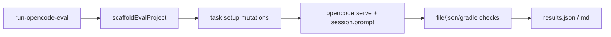

# OpenCode 自动化评测

用**同一批可机器验收的任务**驱动 OpenCode（`opencode serve`），按文件/JSON/`gradlew build` 判定通过与否，并写出报告。不再依赖手工打分表。

> 说明：当前自动化引擎为 **OpenCode**。ModCrafting 应用内 Agent 仍需 Electron/`window.api`，暂未做无 UI 对照跑；两侧对比可先看 OpenCode 通过率，再在应用内对同一任务做抽查。

## 前置条件

1. 安装 OpenCode CLI：`npm i -g opencode-ai@latest`（或使用本仓库 `optionalDependencies`）
2. 验证：`opencode --version`
3. 配置 API Key（任选其一环境变量）：
   - `MODCRAFTING_EVAL_API_KEY`
   - `OPENCODE_API_KEY`
   - `OPENAI_API_KEY` / `ANTHROPIC_API_KEY`（按你用的模型）
4. 可选模型：`MODCRAFTING_EVAL_MODEL` 或 `OPENCODE_MODEL`
5. 本机已有工具链：`resources/jdk-21`、`resources/gradle-9.5`（`npm run setup:toolchain`）

## 一键运行

```bash
# 跑全部可自动任务（较慢：每题可能含 gradlew build）
npm run eval:opencode

# 只跑子集
npm run eval:opencode -- --tasks T01,T04,T10

# 冒烟：跳过 Gradle（只验文件/JSON/输出）
npm run eval:opencode -- --skip-build --tasks T07

# 列出任务
npm run eval:opencode -- --dry-run

# 失败工作区保留在 temp/opencode-eval/workspaces
npm run eval:opencode -- --keep
```

## 报告输出

| 路径 | 内容 |
|------|------|
| `temp/opencode-eval/results.json` | 机器可读结果 |
| `temp/opencode-eval/results.md` | 人类可读表 |
| `docs/opencode-eval-results.md` | 同上（便于在仓库内查看；勿提交 API Key） |

退出码：`0` = 全部通过，`1` = 有失败，`2` = 未安装 OpenCode。

## 任务目录（机器验收）

定义文件：[`scripts/eval/tasks.json`](../scripts/eval/tasks.json)

| ID | 任务 | 自动验收要点 |
|----|------|----------------|
| T01 | 添加物品 copper_coin | Java/lang/model 存在 + build |
| T02 | 合成配方 | recipe JSON 合法 + build |
| T03 | Mixin 跳跃 | Mixin 源码 + mixins.json + build |
| T04 | 修编译错误 | 去掉错误符号 + build |
| T05 | 修错误 Fabric API 版本 | properties 修复 + build |
| T06 | 抽 EvalInitHandler | 新文件 + 主类委托 + build |
| T07 | 探索问答（不改文件） | 输出含入口/assets + 无文件变更 |
| T09 | 添加方块资源 | blockstate/model + build |
| T10 | 修残缺 fabric.mod.json | JSON 合法含 entrypoints + build |
| T08 | runClient 崩溃闭环 | **默认跳过**（过重） |

## 架构



## 本地校验 harness（不调 LLM）

验证脚手架与断言逻辑本身：

```bash
node --experimental-strip-types --test scripts/harness-opencode-eval.test.ts
```

或已包含在：

```bash
npm run test:harness
```

## 扩展任务

编辑 `scripts/eval/tasks.json`：

- `setup`：引用 `scripts/eval/setups.mjs` 中的函数名（如 `injectCompileError`）
- `verify`：使用 `fileExists` / `fileContains` / `fileMatches` / `globExists` / `jsonValid` / `gradleBuild` / `agentOutputContainsAny` / `noFileChanges` 等
- `agent`：`build`（默认）或 `plan`（勘察类）

## 与旧手工表的关系

旧「1–5 分主观维度」已弃用。自动化只输出 **PASS/FAIL + 耗时 + 失败检查项**。若仍要主观对比 ModCrafting UI，对同一 `tasks.json` prompt 在应用内手跑并对照报告即可。
